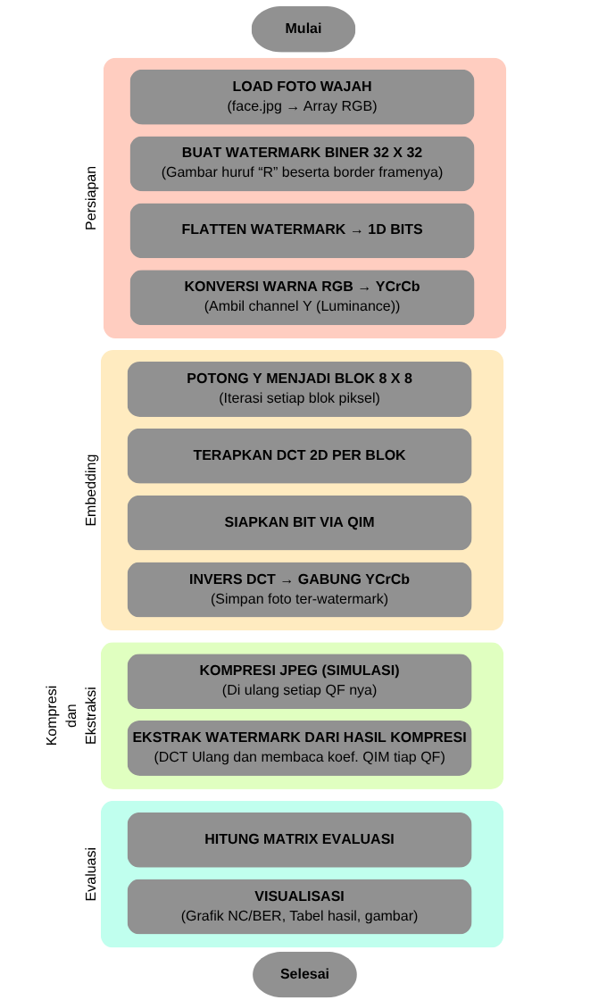
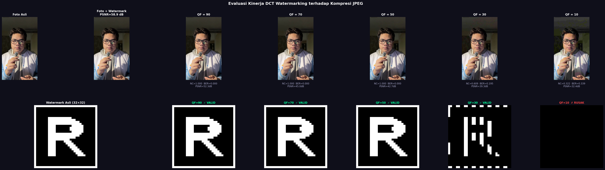
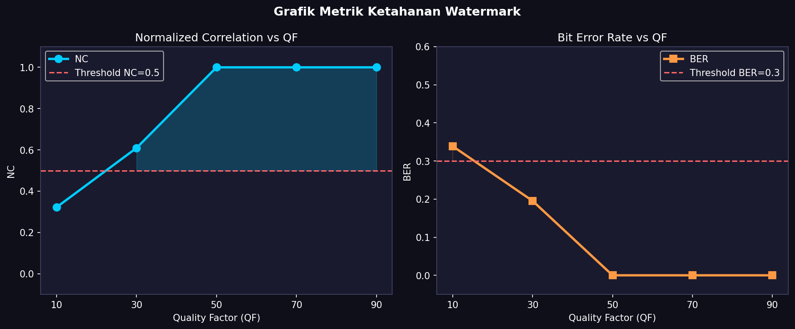

# Watermarking Foto Menggunakan DCT-QIM dan Kompresi JPEG

Implementasi watermarking citra digital yang robust menggunakan:

- Discrete Cosine Transform (DCT)
- Quantization Index Modulation (QIM)
- Simulasi Kompresi JPEG

Proyek ini menyisipkan watermark biner ke dalam foto wajah pribadi dan mengevaluasi ketahanan watermark terhadap berbagai tingkat kompresi JPEG.

---

# Tujuan Proyek

Tujuan dari proyek ini adalah:

- Menyisipkan watermark biner ke dalam foto wajah
- Menjaga kualitas visual setelah proses watermarking
- Menguji ketahanan watermark terhadap kompresi JPEG
- Menentukan batas nilai Quality Factor (QF) ketika watermark tidak dapat diekstrak kembali dengan benar

---

# Alur Watermarking

Arsitektur dan workflow lengkap sistem watermarking:

<p align="center">
  
</p>

---

# Teknologi yang Digunakan

| Komponen | Teknologi |
|---|---|
| Bahasa Pemrograman | Python |
| Pengolahan Citra | OpenCV |
| Komputasi Matriks | NumPy |
| Transformasi DCT | SciPy |
| Visualisasi | Matplotlib |
| Utilitas Gambar | Pillow |

---

# Arsitektur Sistem

Sistem watermarking terdiri dari empat tahap utama:

---

# 1. Tahap Persiapan

## Memuat Foto Wajah

Sistem memuat foto wajah (`face.jpg`) dan mengubahnya menjadi matriks RGB.

<p align="center">
  
</p>

---

## Membuat Watermark Biner

Watermark biner berukuran 32×32 yang berisi huruf **"R"** beserta border dibuat secara otomatis.

---

## Mengubah Watermark Menjadi Bitstream 1D

Citra watermark biner diubah menjadi deretan bit untuk proses embedding.

---

## Konversi RGB → YCbCr

Gambar dikonversi ke ruang warna YCbCr.
Hanya channel luminance (Y) yang digunakan untuk proses watermarking.

---

# 2. Tahap Embedding

## Membagi Gambar Menjadi Blok 8×8

Channel luminance dibagi menjadi blok-blok 8×8 yang tidak saling overlap.

---

## Menerapkan DCT 2D

Setiap blok diproses menggunakan transformasi 2D Discrete Cosine Transform.

---

## Penyisipan Watermark Menggunakan QIM

Bit watermark disisipkan pada koefisien DCT frekuensi menengah menggunakan metode Quantization Index Modulation.

Metode ini menjaga keseimbangan antara:

- Imperceptibility (watermark tidak terlihat)
- Robustness (ketahanan watermark)
- Compression resistance (ketahanan terhadap kompresi)

---

## Rekonstruksi Menggunakan Inverse DCT

Gambar yang telah dimodifikasi direkonstruksi kembali menggunakan inverse DCT.

<p align="center">
  
</p>

---

# 3. Simulasi Kompresi JPEG

Gambar yang telah diberi watermark dikompresi menggunakan beberapa nilai JPEG Quality Factor.

---

# Hasil Kompresi JPEG dan Evaluasi Watermark

| QF | Output | NC | BER | PSNR (dB) | Status |
|---|---|---|---|---|---|
| 90 |  | 1.0000 | 0.0000 | 52.32 | VALID ✓ |
| 70 |  | 1.0000 | 0.0000 | 45.02 | VALID ✓ |
| 50 |  | 1.0000 | 0.0000 | 42.65 | VALID ✓ |
| 30 |  | 0.6094 | 0.1953 | 39.32 | VALID ✓ |
| 10 |  | 0.3223 | 0.3389 | 32.37 | RUSAK ✗ |

---

# Ringkasan Evaluasi

- ✅ Watermark masih dapat diekstrak dengan baik hingga **QF = 30**
- ❌ Watermark mulai rusak dan tidak dapat dibaca pada **QF = 10**
- 📈 Nilai QF tinggi mempertahankan kualitas gambar dan watermark lebih baik
- 📉 Nilai QF rendah menghasilkan artefak kompresi JPEG yang merusak koefisien DCT tempat watermark disisipkan

---

# 4. Tahap Ekstraksi Watermark

Untuk setiap gambar hasil kompresi:

1. DCT diterapkan kembali
2. Koefisien watermark dibaca
3. Bit watermark diekstrak
4. Watermark direkonstruksi kembali menjadi citra utuh

---

# Hasil Ekstraksi Watermark

Perbandingan hasil ekstraksi watermark dari setiap tingkat kompresi JPEG.

<p align="center">
  
</p>

---

# Metrik Evaluasi

Sistem mengevaluasi ketahanan watermark menggunakan:

- NC (Normalized Correlation)
- BER (Bit Error Rate)
- PSNR (Peak Signal-to-Noise Ratio)

<p align="center">
  
</p>

---

# Hasil Eksperimen

| Quality Factor | Status Ekstraksi | Observasi |
|---|---|---|
| 90 | Berhasil | Watermark sangat jelas |
| 70 | Berhasil | Watermark jelas |
| 50 | Berhasil | Sedikit degradasi |
| 30 | Berhasil | Masih dapat dibaca |
| 10 | Gagal | Watermark hancur |

---

# Temuan Utama

Watermark masih robust dan dapat diekstrak hingga:

# ✅ QF = 30

Namun pada:

# ❌ QF = 10

kompresi JPEG menjadi terlalu agresif dan merusak informasi watermark yang disisipkan.

Hal ini menjadi titik breakdown dari metode watermarking yang digunakan.

---

# Instalasi

Install dependency yang dibutuhkan:

```bash
python3 -m pip install opencv-python numpy matplotlib pillow scipy
```

---

# Cara Menjalankan

## 1. Letakkan Foto Wajah

Masukkan foto wajah ke root project dengan nama:

```bash
face.jpg
```

---

## 2. Jalankan Program

```bash
python3 watermarking.py
```

---

## 3. Buka Laporan Evaluasi

Laporan HTML interaktif:

```bash
output/evaluation_report.html
```

Laporan teks:

```bash
output/evaluation_report.txt
```

---

# Parameter Penting

Di dalam `watermarking.py`:

```python
BLOCK_SIZE = 8
ALPHA = 25
QF_LIST = [90, 70, 50, 30, 10]
```

| Parameter | Deskripsi |
|---|---|
| BLOCK_SIZE | Ukuran blok DCT |
| ALPHA | Kekuatan embedding watermark |
| QF_LIST | Nilai JPEG Quality Factor untuk evaluasi |

---

# Insight Teknis

Implementasi ini menunjukkan bagaimana watermarking berbasis domain DCT mampu menjaga keseimbangan antara:

- kualitas visual,
- ketahanan watermark,
- dan resistansi terhadap kompresi.

Penggunaan QIM pada koefisien DCT frekuensi menengah memberikan ketahanan yang baik terhadap kompresi JPEG moderat tanpa merusak kualitas gambar secara signifikan.

---

# Kesimpulan

Proyek ini berhasil mengimplementasikan sistem watermarking yang robust menggunakan DCT-QIM.

Kesimpulan utama:

- Watermark tidak terlihat secara visual pada gambar
- Watermark mampu bertahan terhadap kompresi JPEG moderat
- Proses ekstraksi masih akurat hingga QF = 30
- Pada QF = 10 watermark sudah tidak dapat dibaca kembali

Hal ini membuktikan efektivitas metode DCT-QIM untuk watermarking citra digital yang tahan terhadap kompresi JPEG.